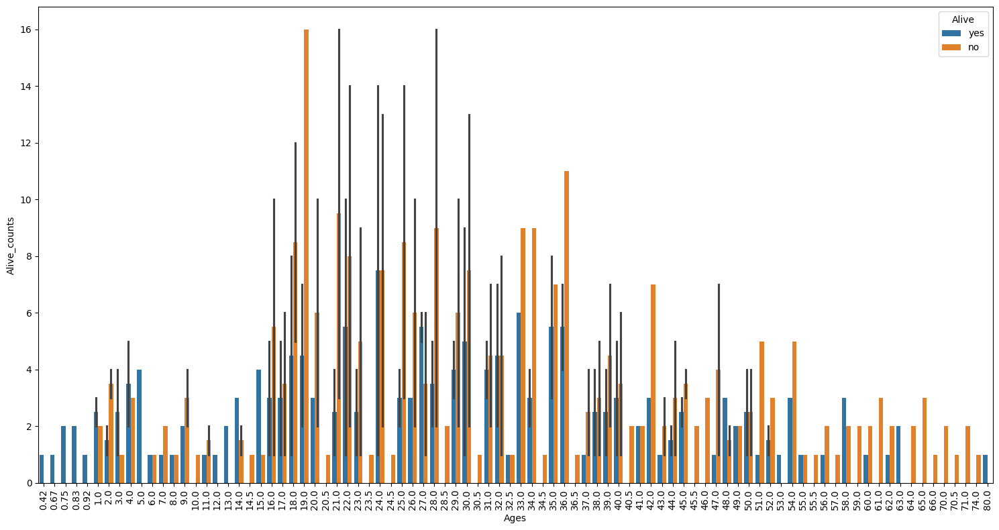
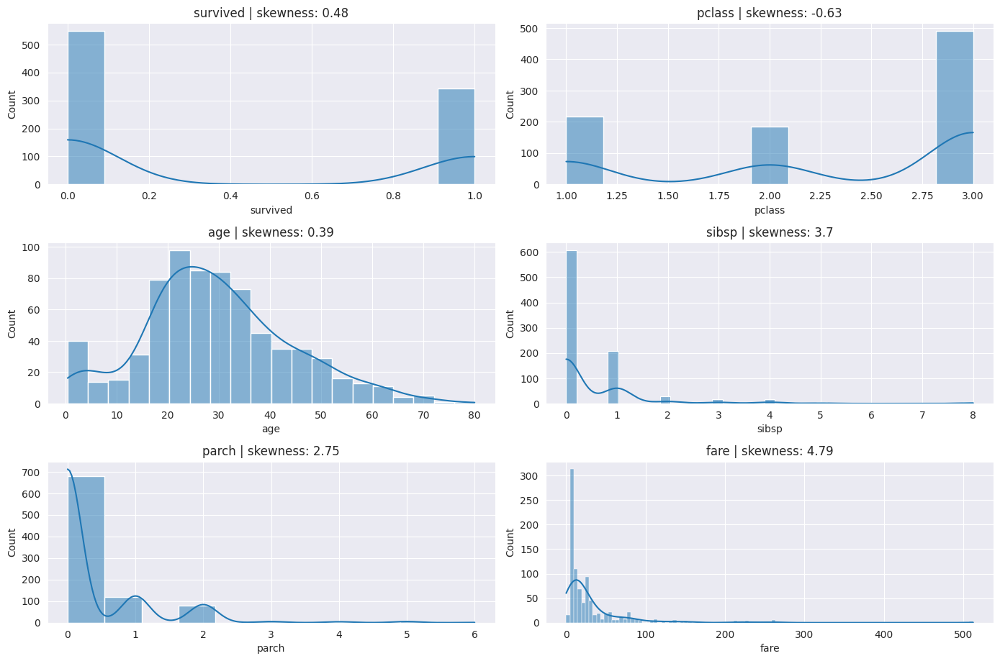
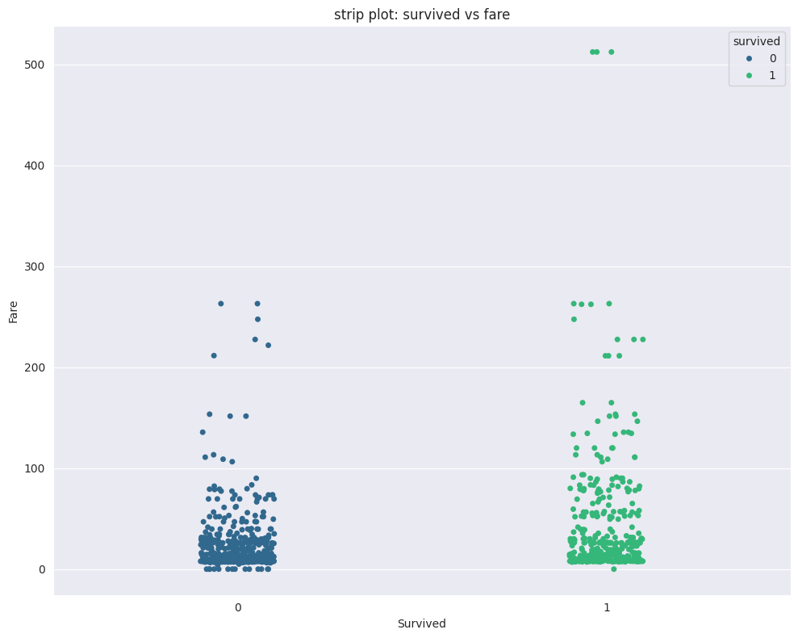
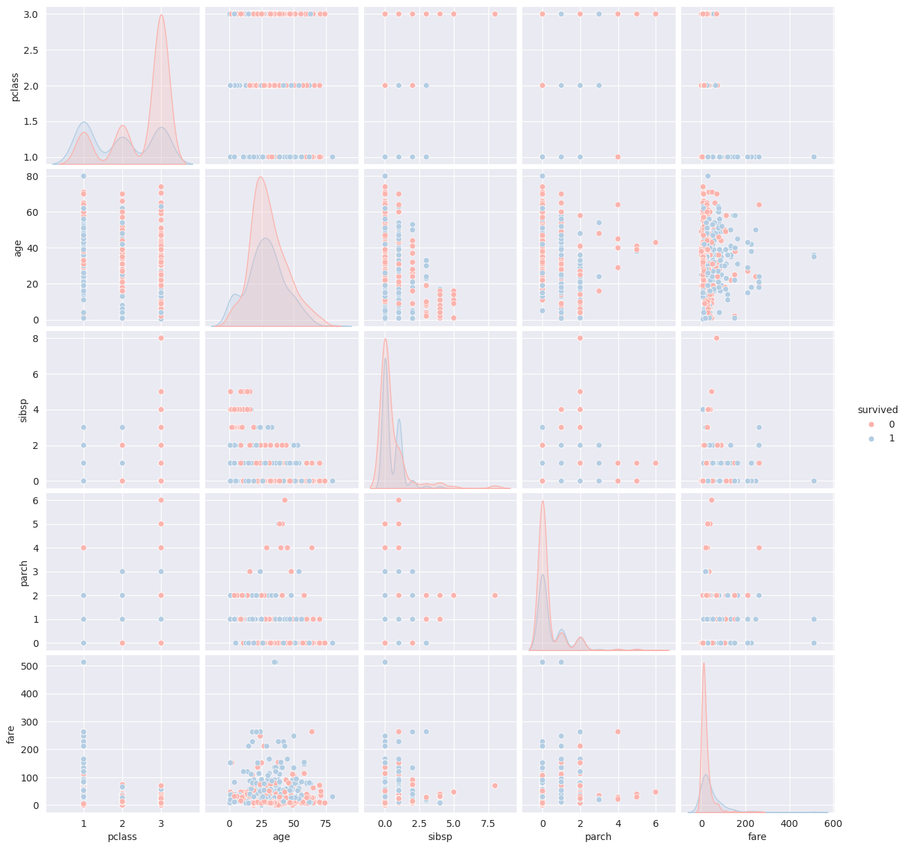
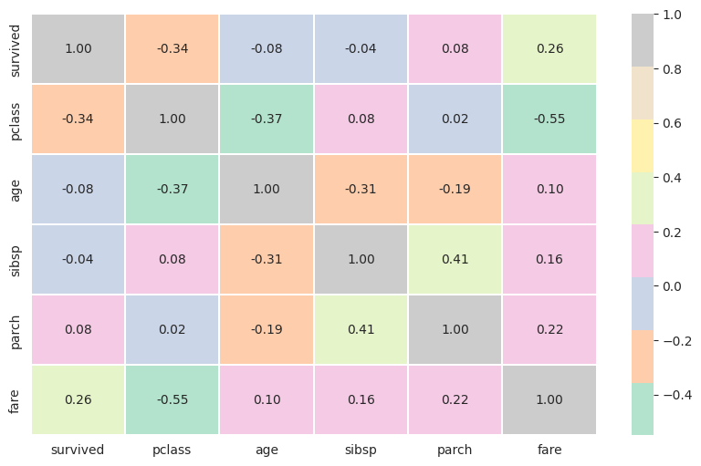

# Titanic Exploratory Data Analysis

## 📌 Project Overview
This project performs Exploratory Data Analysis (EDA) to understand the characteristics of passengers and factors that influenced survival during the disaster.

The analysis focuses on exploring data structure , identifying patterns,visualizing relationship between variables,extracting meaningful insight using statistical analysis and data visualizaton.

##  🧾 Dataset Description
The dataset used in this project is the Titanic dataset, which contains information about passenger aboard the Titanic
It includes demographic details,ticket information ,survival details.
The dataset contains 891 rows and 12 columns,with the target variable being survived.

##  🔍 Key Analysis
The following features of dataset is analyzed

 - Analzed the distribution of passenger age with respect to survival rates
 - Compared the numerical features and examined their correlation realtionships
 - studied relationships between the numerical features

## 📊 Key Visualizations
The following visualizations were created to explore the dataset

 - Age distribution of surviving passengers
   
 - Distribution of numerical features
   
 - Relationship between survival status and fare
   
 - Pairwise relationship between numerical features
    
 - Correlation between numerical features
   

## 🛠 Tools Used

This project was developed using the following tools

- Python
- Numpy
- Pandas
- Matplotlib
- Seaborn
- Colab

